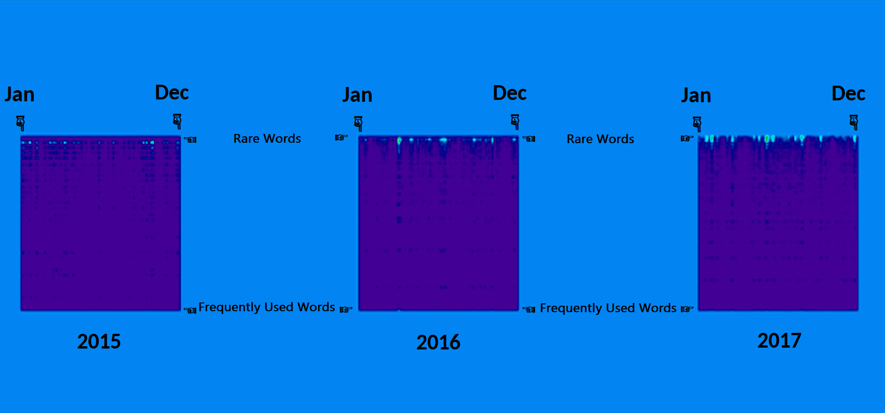

# Grammar Fields

Grammar Fields are a [psychosecurity construct](https://github.com/PsySecGroup/foundation) used for analyzing grammar behavior and language usage over time, with a focus on deviations from the norm, the acquisition of new words, the evolution of grammar, and the passage of time in linguistic development.

To analyze language, we collect and organize all the text that a person has written, arranging it chronologically. We then determine the frequency of "go words" (words that are actively used) and arrange them in ascending order. This compilation forms the basis of the "grammar field," which is then examined for changes in patterns and the speed at which these changes occur. The goal is to make it compatible with neural networks to detect how various factors such as influential individuals, trends, cults, artificial intelligence, and advertising campaigns impact language usage.

This presentation about Grammar Fields will help you understand their underlying principles.

[](https://www.youtube.com/watch?v=EL542ohNCQ4)

You can review the slides in this presentation [here](https://docs.google.com/presentation/d/1cKFFKLI95ioDlW_fxtHoReWlriK5LSDhbhQfQtRQGD4/edit?usp=sharing)

## Technical Definition

To create the Grammar Field, we employ [math.js](https://mathjs.org/docs/datatypes/matrices.html) to generate matrices with the following properties:

* The X-axis represents time as a percentage.
  * Each message needs to have an associated creation date, represented in absolute time units (e.g., UNIX milliseconds).
  * The sequence of time can be repetitive and unordered as long as the index aligns with the message's corresponding timestamp.
  * Each point on the X-axis corresponds to a percentage of time between the earliest and latest timestamps.
  * The X-axis has 100 pixels.
* The Y-axis represents the percentage of word frequency clusters.
  * Words within messages are transformed into their singular forms, and we count their uniqueness.
  * Words with similar frequency distributions are grouped together as a cluster.
  * Each point on the Y-axis represents a percentage of the cluster volume, ranging from the rarest cluster occurrence to the most frequent cluster occurrence.
  * The Y-axis has 100 pixels.
* Each intersection of X and Y coordinates represents a cluster point.
  * Brightness indicates its proximity to the highest value in the field.
  * Drkness represents its distance from the highest value.

## Example

The following image highlights these points:



These are the annual grammar fields of Elon Musk between 2015 and 2017

We see a slurring effect happening to his grammar fields after Trump was elected.

We also see that by 2017, his usage of rare words increases significantly since 2015.

Additional forernsics will reveal these clusters can help us identify what egregores Elon was influenced by.

## Usage

```
npm install github:HyperCrowd/word-cluster-matrix
```

[Please see the tests](tests) for an example of how to use this package.

Tensorflow.js ([Node GPU variant](https://github.com/tensorflow/tfjs/blob/master/tfjs-node/README.md)) is [currently integrated and use grammar fields to be trained](tests/cnn.js)!

